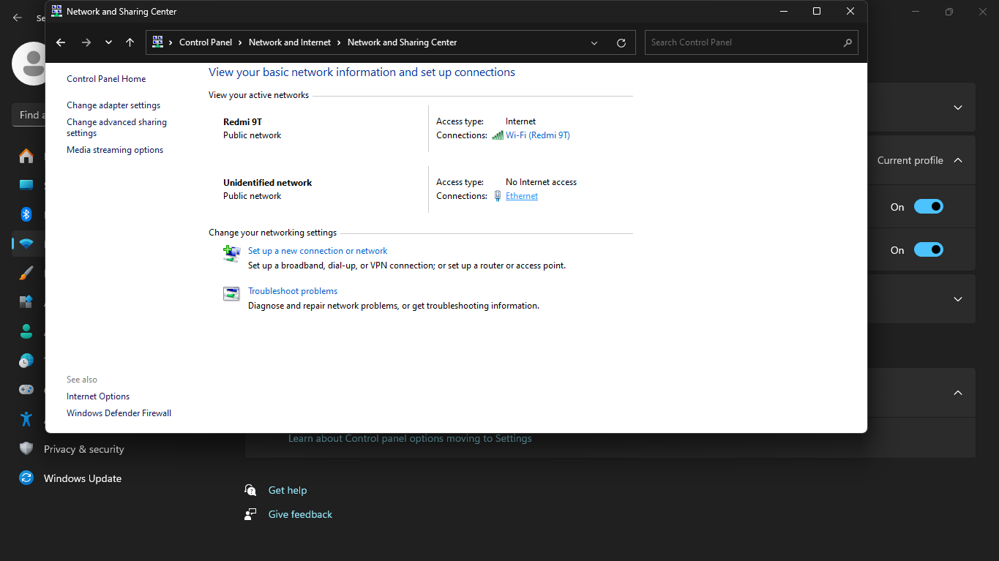

<h1 style="font-weight: bold;">
  LAPORAN PRAKTIKUM 2 JARINGAN KOMPUTER
</h1 >

<h2>Sharing File with LAN Cable</h2>

<h3> Alat dan Bahan </h3> 
<h4>Kabel UTP</h4>
 
 

 
 <h4>2 Device</h4>
 

<h2>Langkah-Langkah Konfigurasi</h2>

<ol>
  <h2> <li>Laptop 1</li></h2>
  <ul>
    <li>Buat folder baru, contoh JARKOM</li>
    
    <li>Klik kanan pada folder, cari "Give access to" lalu pilih "specific poeple..."</li>
    
    <li>Agar folder dapat diakses siapapun, pilih "everyone"</li>
    
    <li>Lalu ubah permission level dari "Read" menjadi "Read/Write" agar siapapun dapat mengubah isi folder</li>
    
    <li>Kemudian klik kanan lagi pada folder, lalu propertis dan ke Sharing pilih bagian "Advenced Sharing..."</li>
    
    <li>Lalu centang  bagian "Share this folder"</li>
    
    <li>Colok kabel UTP ke masing-masing laptop</li>
    
    <li>Buka control panel, pada Network and Internet di klik </li>
    
    <li>Lalu klik bagian "change advanced sharing setting"</li>
    
    <li>Pada bagian Public Network, centang bagian network discovery dan file and printer sharing
    Pada bagian All networks, aktifkan "public folder sharing" dan non-aktifkan "password protected sharing"
    Hal ini berfungsi untuk mengaktifkan permission laptop agar bisa kita berbagi file dengan all devices yang terhubung</li>
    
    <li>Kembali ke control panel, klik bagian "Ethernet"</li>
    
    <li>Cari Internet Protocol Version 4, lalu klik 2 kali</li>
    
    <li>Centang Use the following IP address, dan ketik IP address dan default gatewaynya
    IP address berfungsi sebagai alamat laptop dan default gateway berfungsi sebagai alamat IP laptop yang terhubung</li>
    
  </ul>

  

  <h2><li>Laptop 2</li></h2>
  <ul>
    <li>Buka control panel, lalu klik Network and Internet</li>
    
    <li>Lalu klik bagian change advanced sharing setting</li>
    
    <li>Sama seperti langkah ke-9</li>
    
    <li>Lalu kembali ke control panel klik ethernet, lalu cari IPV 4 dan klik 2 kali</li>
    
    <li>Ketik IP address yang sama dengan IP Laptop 1, tapi bedakan angka paling belakang</li>
    
    <li>Kembali ke dekstop, tekan "Windows+R" dan ketik cmd
    Lalu ketik ping IP Laptop 1 tadi. Hal ini berfungsi untuk mengetahui apakah Laptop 2 terhubung atau tidak ke Laptop 1</li>
    
    <li>Buka File eksplorer, lalu scroll kebawah dan klik Network, lalu ketik path dari folder yang di sharing Laptop 1</li>
    
    <li>Sekarang folder sudah bisa di lihat dan di edit oleh Laptop 2</li>
    
    
  </ul>
</ol>

<h2>Analisis Percobaan</h2>

Berdasarkan hasil percobaan, penggunaan kabel LAN dengan konfigurasi IP Address IPv4 memungkinkan komunikasi langsung antar komputer tanpa memerlukan koneksi internet. Kecepatan transfer data yang tinggi menjadi keunggulan utama dibandingkan metode lain seperti penggunaan flash drive atau transfer melalui jaringan Wi-Fi yang lebih lambat dan rentan terhadap gangguan sinyal.

<h2>Kesimpulan</h2>

Praktikum ini membuktikan bahwa transfer file antar komputer menggunakan kabel LAN dengan IP Address IPv4 adalah metode yang efisien dan stabil. Kecepatan tinggi dan keamanan menjadi keunggulan utama, meskipun terdapat keterbatasan dalam jangkauan dan fleksibilitas. Metode ini ideal digunakan dalam lingkungan jaringan lokal yang membutuhkan kecepatan dan keamanan tanpa perlu koneksi internet.

